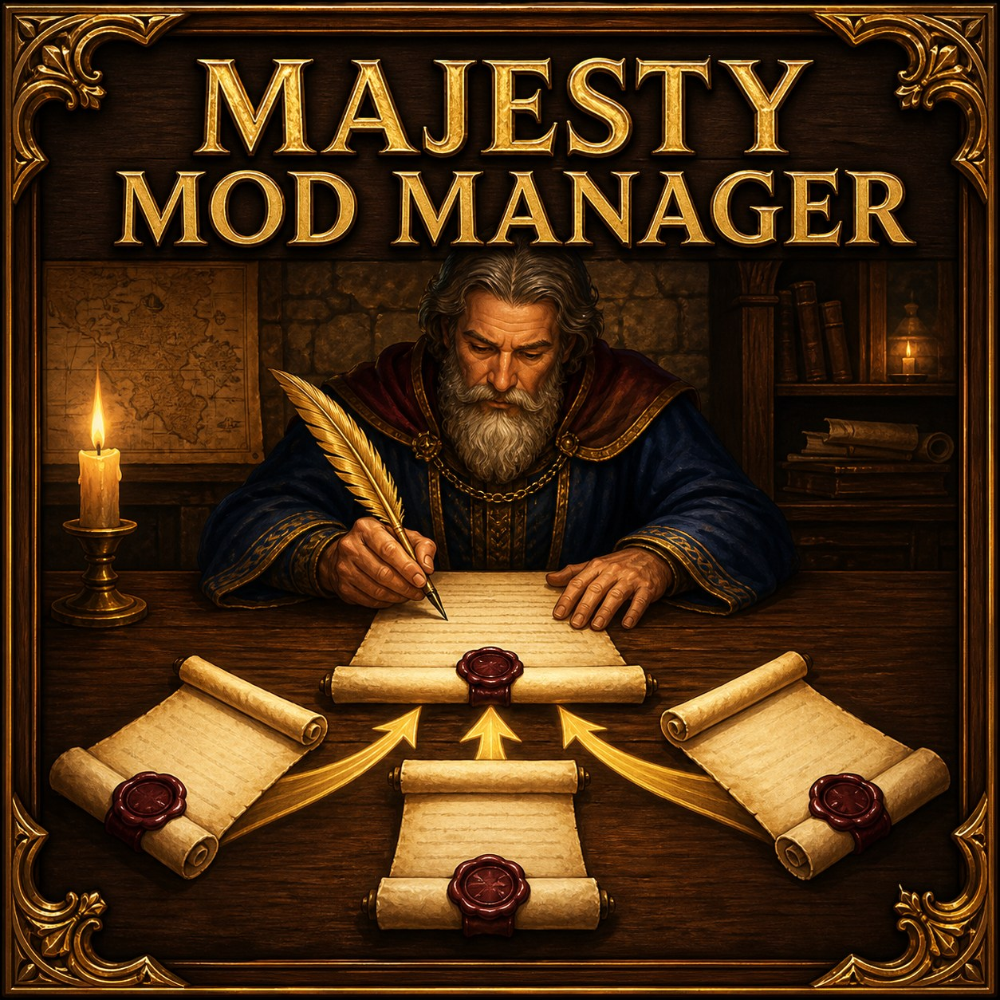

# Majesty Mod Manager



Majesty Gold HD Mod Manager is a Windows app for finding, organizing, and
launching the **Majesty Gold HD** mods and quests you have installed or
subscribed to through Steam Workshop.

It also provides the extra support required by more complicated mods, such as
custom guilds, so compatible mods can be used individually or together without
overwriting one another.

## Features

- Finds local and Steam Workshop mods and downloaded quests automatically.
- Organizes content into **Merge**, **Standard**, **Quests**, and
  **Quality of Life** tabs.
- Enables detected mods by default and remembers your later choices.
- Groups multi-option Workshop packages and prevents incompatible variants
  from being enabled together.
- Clearly marks content that cannot be combined safely.
- Prepares one playable package when selected mods need to be combined.
- Leaves subscribed mods and downloaded quests unchanged.
- Installs and manages the supported Majesty quality-of-life patches.
- Supports both maintained Steam versions of Majesty Gold HD.
- Launches the game with the additional support required by prepared mods and
  Freestyle games.

## Install and use

The Steam Workshop download and each GitHub Release contain the complete
application. Keep `Majesty Mod Manager.exe` beside its `_internal` folder.

1. Subscribe to the Mod Manager and the Majesty mods or quests you want to use.
2. Open the Mod Manager's Workshop folder and run
   `Majesty Mod Manager.exe`. From Majesty's installation folder, go up to
   `steamapps`, then open `workshop/content/73230/3793024054`.
3. Follow the first-time prompt to install the two required game helpers.
4. Review the detected content and choose what you want enabled.
5. Select **Prepare Selected Mods** if the Merge tab contains selected mods.
6. Select **Launch Majesty**.

Continue launching through the manager whenever prepared Merge content is
enabled. Ordinary Standard mods and downloaded quests remain usable through
Majesty normally.

If finding Steam's Workshop folder is inconvenient, download the latest
complete ZIP from [GitHub Releases](https://github.com/Phantomstar721/majesty-gold-hd-mod-manager/releases/latest).
After the first launch, **Desktop Shortcut** creates an optional shortcut to
the manager without moving it away from its required support files.

## Content tabs

| Tab | Purpose |
| --- | --- |
| **Merge** | Compatible content that needs the manager to work safely alongside other complex mods. |
| **Standard** | Ordinary Majesty mods that the game can load independently. |
| **Quests** | Downloaded adventures and maps available through Majesty's quest browser. |
| **Quality of Life** | Optional game improvements that can be installed or removed individually. |

Items that do not change the game, such as modding tools, are identified but
are not selectable. If a Merge mod is missing required compatibility
information, the manager displays it in red with an explanation instead of
building an unsafe package.

## For mod creators: making a mod compatible

A compatible Merge mod does not need to be hardcoded into the Mod Manager. If
the distributed package follows this format and passes validation, the manager
can detect and combine it automatically. The current public format covers CAM
and GPL packages both with and without custom buildings.

### Package layout

Place exactly one `.mmxml` manifest and one `mod-definition.json` in the top
level of the distributed mod folder:

```text
YourMod/
|-- YourMod.mmxml
|-- mod-definition.json
|-- Data/
|   |-- your_mod_data.cam
|   |-- your_mod_interface.cam
|   |-- your_mod.bcd
|   `-- your_descriptions.xml
|-- GPL/
|   |-- your_mod.gpl
|   `-- your_data.dat
`-- Assets/
    `-- any additional files
```

The subfolder names are flexible. Every path used by the `.mmxml` must be
relative to the package, remain inside it, and point to a file included in the
distributed package.

The `.mmxml` must:

- Have a stable, unique Mod UUID and a player-facing display name.
- Contain one or more `Dataset` elements, each with `base="Any"`.
- Use only `CAM`, `Descriptions`, and `GPL` load directives.
- Include at least one CAM load and one GPL load.
- List the compiled GPL target and every `.gpl` or `.dat` source needed to
  rebuild it.
- Include every description, artwork, sound, and data file required by the
  mod.

### Mod definition

The top-level `mod-definition.json` should use schema version 3:

```json
{
  "schema_version": 3,
  "mod_id": "{the-same-uuid-used-by-your-mmxml}",
  "internal_name": "YourNamespacedModName",
  "display_name": "Your Player-Facing Mod Name",
  "custom_buildings": [
    {
      "local_name": "YourNamespacedBuildingID",
      "controller_base": "AP10",
      "panel_resource_template": "AP10"
    }
  ],
  "runtime_features": []
}
```

`schema_version` identifies the Mod Manager compatibility-file format, not the
version of the mod. Version 2 remains supported under its original rules.
Version 1 remains readable for existing trusted compatibility adapters, but an
unadapted version-1 Merge package is not selectable. New packages should use
version 3.

**Do not add `dialog_id`, a building panel FourCC, or a reserved `CGxx` name to
a version-3 definition.** The manager finds the source panel ID already used by
the building's XML Description and `SMNU`/`STRT` resources, assigns a
collision-free internal ID for the generated profile, and rewrites those
references together. Set `custom_buildings` to an empty array when the mod has
no custom building. `controller_base` and `panel_resource_template` identify
the stock Majesty building behavior and panel layout that a declared building
follows; the supported pairs are `AP07`/`AP10`, `AP10`/`AP10`, and
`MX09`/`MX09`. The MX09 pair is used with the typed AP41 reward-panel recipe
described in the complete contract.

Leave `runtime_features` empty unless the mod uses one of the optional,
reusable stock-behavior recipes documented below. Normal custom buildings and
supported primary building panels do not require a package-specific feature. The manager
automatically supplies shared building-slot, Freestyle, visitor-list, and
compatible custom-text support. Unknown feature types and malformed or
conflicting records are rejected rather than guessed.

The currently supported author-declared recipes are:

```json
"runtime_features": [
  {
    "type": "stock.name-generator.v1",
    "generator_id": "NM42",
    "name_tables": ["HN81", "HN82", "HN83", "HN84"]
  },
  {
    "type": "stock.ap78-enchantment-row.v1",
    "overlay_id": "OV42",
    "display_text": "Example enchantment description"
  }
]
```

The name-generator recipe uses Majesty's stock name-registry construction and
requires four private tables outside stock `HN01`–`HN68` plus a package
Description that selects the
declared `NM` generator. The enchantment-row recipe presents a package-owned
Overlay addition through Majesty's stock AP78 enchantment row. Multiple
non-conflicting declarations can be combined within the documented bounds.

The manager also supports data-only recipes for AP10/AP69 secondary panels,
AP22 resource meters, AP99 research rows, AP17 upgrade gates, AP24 Rage-backed
actions, AP69 sovereign-target actions, and MX09/AP41 reward panels with
private Fl00-shaped hostile-monster reward flags. It can also clone MX22's
per-building open/closed controls, populate generic MX05 live-agent lists with
bounded package-declared static row variants, and append package-owned boolean
choices to the end of stock GPLMx `Purchase_Equipment` or `Purchase_Bazaar`. Their linked
logical keys are local to the package. Visible controls are reserved within
their own authored panel;
global engine identities such as private descriptor commands, packed
attributes, callback symbols, private modes, and private units are checked
across the complete selection. See the
[complete merge-mod contract](docs/manager-merge-contract.md#stock-controller-recipes)
for the exact JSON fields, required resources, and stock lifecycle limits. A
complete parser-checked file showing every supported recipe is available as
[mod-definition-v3-all-features.json](docs/examples/mod-definition-v3-all-features.json).
Copy only the recipes your package needs. Its package-owned controls and IDs
are illustrative and must match the resources the package ships. Fields named
`*_template_control_id` are different: they select one of the bounded stock
Majesty templates proved for that recipe version, and cannot be replaced with
an arbitrary private control. The complete contract lists the currently
accepted stock templates and their required metadata.

If a mod needs native or DLL behavior that is not yet supported, do not bundle
a private DLL or patch instructions. Propose the behavior as a reusable Mod
Manager feature in a
[pull request to this repository](https://github.com/Phantomstar721/majesty-gold-hd-mod-manager/pulls),
following the
[runtime feature contribution guide](docs/adding-runtime-features.md).

### Content requirements

- Namespace all custom Description IDs, CAM resource keys, GPL functions and
  expressions, DAT blocks, authored panel resources, artwork, and sound
  filenames.
- Ship complete effective tables when changing resources Majesty treats as
  positional or whole-table data.
- Preserve unchanged stock entries, ordering, flags, padding, and references.
- In GPL, do not exit a function with `return` from inside a `foreach` body.
  Record the result during the loop and return it afterward, following Majesty's
  stock control-flow pattern. The manager rejects this crash-prone source shape.
- If the mod changes BDEP, main art, or interface art, include the complete
  effective stock-relative resource. A version-3 package may omit any of those
  domains it does not change and may provide at most one art provider per
  changed domain.
- Use named inventory items for new carried items rather than adding private
  numeric QITM rows.
- Do not depend on files from an authoring repository or another Workshop
  folder.

The manager currently supports CAM sections `SMNU`, `STRT`, `DATA`, `IMAG`,
`TILE`, `SPLT`, `PALT`, `DSND`, and `WAVE`, with `BDEP` supported inside
`DATA`. Main art uses `SPLT`; Majesty's interface art may use `PALT`.
Packages using other resource structures require additional typed support
before they can be merged safely.

### Testing compatibility

Install the finished package exactly as players will receive it and select
**Rescan Content** in the Mod Manager. A package that passes validation appears
in the Merge tab as selectable. If required information is missing or an
unsupported structure is detected, the mod appears in red with the reason it
cannot be combined.

For the complete technical rules, see the
[Merge mod authoring guide](docs/manager-merge-contract.md).

## Compatibility and safety

The manager supports both maintained Steam versions:

- Default Public Version `1.5.2.24`
- `beta2` Steam Multiplayer Support `1.5.2.28`

The detected version and installation folder are shown at the top of the app.
Use **Choose…** if you want the manager to use a different supported
`MajestyHD.exe`.

## Building from source

Python 3.9 or newer is required. Building the native runtime also requires the
x86 Visual C++ build tools and a Windows 10 SDK:

```powershell
& ".\Setup - Majesty Mod Manager.bat"
& ".\Launch - Majesty Mod Manager.bat"
.\.venv\Scripts\python.exe -m unittest discover -s tests
```

The complete release payload also uses the following public projects. By
default, clone them beside this repository using these directory names:

- `majesty-gold-hd-generic-visitor-lists`
- `majesty-gold-hd-remember-active-mods`
- `majesty-gold-hd-qol-utilities`
- `majesty-gold-hd-custom-guild-phantoms-haunt`

`scripts\Stage-ModManagerPayload.ps1` and
`scripts\Build-ModManagerExe.ps1` also accept explicit paths for each dependency
when your checkout layout is different. The runtime build locates an installed
x86 Visual C++ toolchain and matching Windows 10 SDK automatically; their roots
can likewise be supplied explicitly when needed.

Build the standalone Windows application with:

```powershell
powershell -ExecutionPolicy Bypass -File .\scripts\Build-ModManagerExe.ps1
```

The finished application is written to `dist\Majesty Mod Manager`.

Mod authors interested in making compatible content can read the
[Merge mod authoring guide](docs/manager-merge-contract.md). Developers adding
new native support should also read the
[runtime feature contribution guide](docs/adding-runtime-features.md).

## Community

Join the Majesty community on [Discord](https://discord.gg/MEjtKZb9GQ).

## License

The Majesty Gold HD Mod Manager source and project-owned artwork are licensed
under the [MIT License](LICENSE).

The packaged application contains separately licensed components. Their
licenses, notices, and source links are listed in
[THIRD-PARTY-NOTICES.md](THIRD-PARTY-NOTICES.md), and the Workshop package
includes the applicable license texts.

Majesty Gold HD and its assets are the property of their respective owners.
This project is an independent community tool and is not affiliated with or
endorsed by the game's rights holders, Valve, or Steam.
